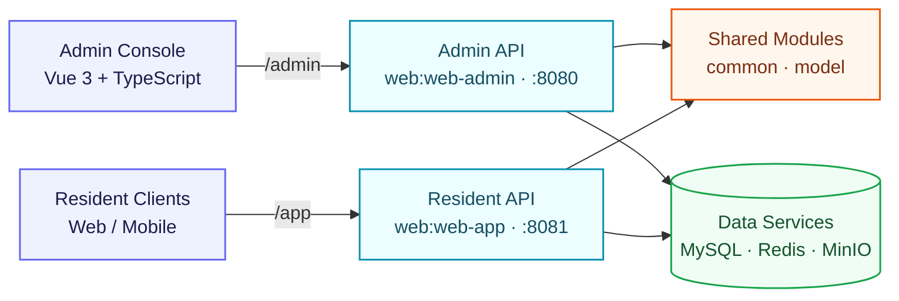

# Lease

<p align="center">
  <strong>Apartment inventory, leasing, appointments, and user management in one platform.</strong>
</p>

<p align="center">
  <strong>English</strong> | <a href="README.zh-CN.md">简体中文</a>
</p>

Lease is a rental management platform with a Spring Boot administration API and a resident-facing API. The current workspace also includes a separately versioned Vue administration console. The backend is organized as a Gradle multi-project build and uses MySQL, Redis, and MinIO for persistence, caching, and object storage.

> [!NOTE]
> This project is under active development. Some API surfaces may still be incomplete or change.

## Features

- Manage apartments, rooms, facilities, labels, attributes, fees, payment types, and lease terms.
- Manage lease agreements, viewing appointments, resident accounts, staff accounts, and staff posts.
- Browse published apartments and rooms through the resident-facing API.
- Record browsing history and support appointment and lease-agreement workflows.
- Stateless authentication with Spring Security and JWT.
- Phone verification-code login for residents; local verification codes are written to the application log.
- Image and file storage through MinIO.
- Interactive OpenAPI documentation through Swagger UI.

## Technology stack

| Area | Technologies |
| --- | --- |
| Backend | Java 21, Spring Boot 3.5, Spring Web, Spring Data JPA, Spring Security |
| API and auth | REST, OpenAPI/Swagger UI, JWT |
| Data services | MySQL 8, Redis 7, MinIO |
| Admin frontend | Vue 3, TypeScript, Vite 4, Element Plus, Pinia, Vue Router |
| Build and deployment | Gradle 9.2 Wrapper, npm, Docker Compose |

## Architecture



## Repository layout

```text
.
├── common/                       # Shared backend components
├── model/                        # JPA entities and domain enums
├── web/
│   ├── web-admin/                # Administration API
│   └── web-app/                  # Resident-facing API
├── rentHouseAdmin/               # Separate Vue administration-console checkout
├── sql_scripts/lease.sql         # Schema and sample data
├── docker-compose.web-admin.yml  # Admin API and infrastructure stack
└── build.gradle                  # Shared Gradle configuration
```

`rentHouseAdmin/` has its own Git history and is intentionally ignored by the backend repository. The frontend commands below assume that this companion checkout is present at that path.

## Quick start with Docker

This is the shortest path to start the administration API together with MySQL, Redis, and MinIO.

### Prerequisites

- Docker with Docker Compose
- Node.js 18+ and npm, if you also want to run the admin console

### 1. Configure secrets

```bash
cp .env.web-admin.example .env
```

Edit `.env` and replace every `change-me-*` value. Keep `JWT_SECRET` at least 32 random characters long. The `.env` file is ignored by Git.

### 2. Start the admin stack

```bash
docker compose --env-file .env -f docker-compose.web-admin.yml up -d --build
```

On the first start with an empty MySQL volume, `sql_scripts/lease.sql` is imported automatically.

| Service | Default address |
| --- | --- |
| Administration API | `http://localhost:8080` |
| Admin Swagger UI | `http://localhost:8080/swagger-ui/index.html` |
| MinIO API | `http://localhost:9000` |
| MinIO Console | `http://localhost:9001` |

Useful lifecycle commands:

```bash
docker compose --env-file .env -f docker-compose.web-admin.yml ps
docker compose --env-file .env -f docker-compose.web-admin.yml logs -f web-admin
docker compose --env-file .env -f docker-compose.web-admin.yml down
```

`down` keeps the named data volumes. Add `--volumes` only when you intentionally want to delete the local database and object-store data.

### 3. Start the admin console

In another terminal:

```bash
cd rentHouseAdmin
npm ci
npm run dev
```

Open `http://localhost:5173`. In development, Vite proxies `/admin` requests to the administration API configured by `VITE_APP_BASE_URL` in `rentHouseAdmin/.env.development`.

## Run from source

### Prerequisites

- JDK 21
- MySQL 8.x
- Redis 7.x
- MinIO
- Node.js 18+ and npm for the admin console

The Gradle Wrapper is included, so a separate Gradle installation is not required.

You can start only the infrastructure from the Compose file:

```bash
cp .env.web-admin.example .env
# Edit .env before continuing.
docker compose --env-file .env -f docker-compose.web-admin.yml up -d mysql redis minio
```

Run the administration API after exporting the matching database, Redis, MinIO, and JWT environment variables:

```bash
./gradlew :web:web-admin:bootRun
```

Run the resident-facing API:

```bash
./gradlew :web:web-app:bootRun
```

The resident API currently has machine-specific Redis and MinIO defaults in `web/web-app/src/main/resources/application.yml`. Override `spring.datasource.*`, `spring.data.redis.*`, and `minio.*` for your environment through Spring Boot command-line properties or environment variables.

## API documentation and authentication

| Application | Base path | Swagger UI | OpenAPI JSON |
| --- | --- | --- | --- |
| Administration API | `/admin` | `http://localhost:8080/swagger-ui/index.html` | `http://localhost:8080/v3/api-docs` |
| Resident API | `/app` | `http://localhost:8081/swagger-ui/index.html` | `http://localhost:8081/v3/api-docs` |

Protected endpoints expect a JWT bearer token:

```http
Authorization: Bearer <token>
```

The login and Swagger endpoints are public. The resident API also allows anonymous access to apartment, room, region, payment-type, and lease-term browsing endpoints.

> [!IMPORTANT]
> The sample `system_user` rows in `lease.sql` use legacy MD5 password hashes, while the current administration login verifies BCrypt hashes. Migrate or recreate those passwords with BCrypt before using the seeded accounts to sign in.

## Configuration

The administration API supports these primary environment variables:

| Variable | Purpose | Local default |
| --- | --- | --- |
| `DB_URL` | MySQL JDBC URL | `jdbc:mysql://localhost:3306/lease` |
| `DB_USERNAME` | MySQL user | `root` |
| `DB_PASSWORD` | MySQL password | Empty |
| `REDIS_HOST`, `REDIS_PORT`, `REDIS_PASSWORD` | Redis connection | `localhost:6379` |
| `MINIO_ENDPOINT` | MinIO endpoint | `http://localhost:9000` |
| `MINIO_ACCESS_KEY`, `MINIO_SECRET_KEY` | MinIO credentials | Development defaults |
| `MINIO_BUCKET_NAME` | Object bucket | `lease-bucket` |
| `JWT_SECRET` | Admin JWT signing secret | Development default |

Never commit production secrets. Use `.env.web-admin.example` only as a template.

## Development commands

Backend:

```bash
./gradlew build
./gradlew test
./gradlew :web:web-admin:bootJar
./gradlew :web:web-app:bootJar
```

Admin frontend:

```bash
cd rentHouseAdmin
npm run lint
npm run build
```

## Data initialization

The SQL script contains the schema and sample records. Docker imports it only when the `mysql-data` volume is created for the first time. If you change the script later, either apply the migration manually or deliberately recreate the local volume after backing up any data you need.
