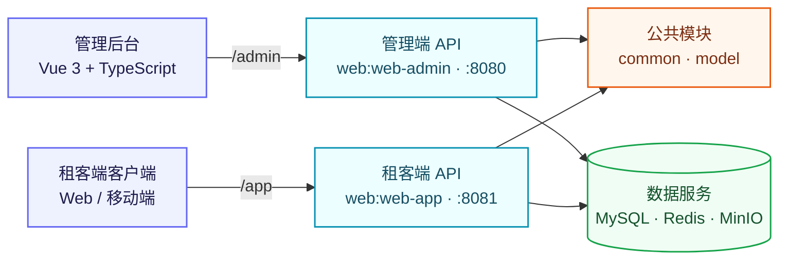

# Lease 租赁管理平台

<p align="center">
  <strong>一站式管理公寓房源、租约、看房预约与用户。</strong>
</p>

<p align="center">
  <a href="README.md">English</a> | <strong>简体中文</strong>
</p>

Lease 是一个租赁管理平台，包含 Spring Boot 管理端 API 和面向租客的 API；当前工作区还包含一个单独进行版本管理的 Vue 管理后台。后端采用 Gradle 多项目结构，使用 MySQL、Redis 和 MinIO 分别提供数据持久化、缓存与对象存储能力。

> [!NOTE]
> 项目仍在持续开发中，部分 API 可能尚未完整实现或发生变更。

## 功能概览

- 管理公寓、房间、配套设施、标签、属性、杂费、支付方式和租期。
- 管理租约、看房预约、租客账号、后台员工账号与岗位。
- 通过租客端 API 浏览已发布的公寓和房间。
- 记录浏览历史，支持看房预约与租约业务流程。
- 使用 Spring Security 和 JWT 实现无状态认证。
- 租客通过手机验证码登录；本地开发时验证码会输出到应用日志。
- 通过 MinIO 存储图片和文件。
- 通过 Swagger UI 提供可交互的 OpenAPI 文档。

## 技术栈

| 范围 | 技术 |
| --- | --- |
| 后端 | Java 21、Spring Boot 3.5、Spring Web、Spring Data JPA、Spring Security |
| API 与认证 | REST、OpenAPI/Swagger UI、JWT |
| 数据服务 | MySQL 8、Redis 7、MinIO |
| 管理端前端 | Vue 3、TypeScript、Vite 4、Element Plus、Pinia、Vue Router |
| 构建与部署 | Gradle 9.2 Wrapper、npm、Docker Compose |

## 系统架构



## 项目结构

```text
.
├── common/                       # 后端公共组件
├── model/                        # JPA 实体与领域枚举
├── web/
│   ├── web-admin/                # 管理端 API
│   └── web-app/                  # 租客端 API
├── rentHouseAdmin/               # 单独版本管理的 Vue 管理后台检出目录
├── sql_scripts/lease.sql         # 数据库结构与示例数据
├── docker-compose.web-admin.yml  # 管理端 API 与基础设施编排
└── build.gradle                  # Gradle 公共配置
```

`rentHouseAdmin/` 拥有独立的 Git 历史，因此有意被后端仓库忽略。下文的前端命令假设配套前端项目已检出到该路径。

## 使用 Docker 快速启动

这是同时启动管理端 API、MySQL、Redis 和 MinIO 的最短路径。

### 环境要求

- Docker 与 Docker Compose
- 如需运行管理后台界面，还需要 Node.js 18+ 和 npm

### 1. 配置密钥

```bash
cp .env.web-admin.example .env
```

编辑 `.env`，替换全部 `change-me-*` 值。`JWT_SECRET` 应至少包含 32 个随机字符。`.env` 已被 Git 忽略，不会进入版本控制。

### 2. 启动管理端服务栈

```bash
docker compose --env-file .env -f docker-compose.web-admin.yml up -d --build
```

首次使用空 MySQL 数据卷启动时，Compose 会自动导入 `sql_scripts/lease.sql`。

| 服务 | 默认地址 |
| --- | --- |
| 管理端 API | `http://localhost:8080` |
| 管理端 Swagger UI | `http://localhost:8080/swagger-ui/index.html` |
| MinIO API | `http://localhost:9000` |
| MinIO 控制台 | `http://localhost:9001` |

常用生命周期命令：

```bash
docker compose --env-file .env -f docker-compose.web-admin.yml ps
docker compose --env-file .env -f docker-compose.web-admin.yml logs -f web-admin
docker compose --env-file .env -f docker-compose.web-admin.yml down
```

`down` 会保留命名数据卷。只有在确定要删除本地数据库与对象存储数据时，才应额外添加 `--volumes`。

### 3. 启动管理后台界面

打开另一个终端：

```bash
cd rentHouseAdmin
npm ci
npm run dev
```

访问 `http://localhost:5173`。开发模式下，Vite 会将 `/admin` 请求代理到 `rentHouseAdmin/.env.development` 中 `VITE_APP_BASE_URL` 指定的管理端 API。

## 从源码运行

### 环境要求

- JDK 21
- MySQL 8.x
- Redis 7.x
- MinIO
- 管理后台界面需要 Node.js 18+ 和 npm

项目已包含 Gradle Wrapper，无需单独安装 Gradle。

可以先只启动 Compose 中的基础设施：

```bash
cp .env.web-admin.example .env
# 继续前请先编辑 .env。
docker compose --env-file .env -f docker-compose.web-admin.yml up -d mysql redis minio
```

导出与上述数据库、Redis、MinIO 和 JWT 配置相匹配的环境变量后，启动管理端 API：

```bash
./gradlew :web:web-admin:bootRun
```

启动租客端 API：

```bash
./gradlew :web:web-app:bootRun
```

租客端 API 的 `web/web-app/src/main/resources/application.yml` 当前包含特定局域网环境的 Redis 和 MinIO 默认地址。请通过 Spring Boot 命令行属性或环境变量覆盖 `spring.datasource.*`、`spring.data.redis.*` 和 `minio.*`，使其匹配你的运行环境。

## API 文档与认证

| 应用 | 基础路径 | Swagger UI | OpenAPI JSON |
| --- | --- | --- | --- |
| 管理端 API | `/admin` | `http://localhost:8080/swagger-ui/index.html` | `http://localhost:8080/v3/api-docs` |
| 租客端 API | `/app` | `http://localhost:8081/swagger-ui/index.html` | `http://localhost:8081/v3/api-docs` |

受保护的接口需要携带 JWT Bearer Token：

```http
Authorization: Bearer <token>
```

登录和 Swagger 相关接口无需认证。租客端 API 的公寓、房间、地区、支付方式与租期浏览接口也允许匿名访问。

> [!IMPORTANT]
> `lease.sql` 中的 `system_user` 示例数据使用旧版 MD5 密码哈希，而当前管理端登录使用 BCrypt 校验。使用这些示例账号登录前，需要将密码迁移为 BCrypt 哈希或重新创建账号密码。

## 配置说明

管理端 API 支持以下主要环境变量：

| 变量 | 用途 | 本地默认值 |
| --- | --- | --- |
| `DB_URL` | MySQL JDBC 地址 | `jdbc:mysql://localhost:3306/lease` |
| `DB_USERNAME` | MySQL 用户名 | `root` |
| `DB_PASSWORD` | MySQL 密码 | 空 |
| `REDIS_HOST`、`REDIS_PORT`、`REDIS_PASSWORD` | Redis 连接 | `localhost:6379` |
| `MINIO_ENDPOINT` | MinIO 地址 | `http://localhost:9000` |
| `MINIO_ACCESS_KEY`、`MINIO_SECRET_KEY` | MinIO 凭据 | 开发环境默认值 |
| `MINIO_BUCKET_NAME` | 对象存储桶 | `lease-bucket` |
| `JWT_SECRET` | 管理端 JWT 签名密钥 | 开发环境默认值 |

请勿提交生产环境密钥，`.env.web-admin.example` 仅用作配置模板。

## 开发命令

后端：

```bash
./gradlew build
./gradlew test
./gradlew :web:web-admin:bootJar
./gradlew :web:web-app:bootJar
```

管理端前端：

```bash
cd rentHouseAdmin
npm run lint
npm run build
```

## 数据初始化

SQL 脚本包含数据库结构和示例数据。Docker 只会在首次创建 `mysql-data` 数据卷时自动导入该脚本。后续修改 SQL 脚本后，应手动应用变更；也可以在备份所需数据后，有意地重新创建本地数据卷。
